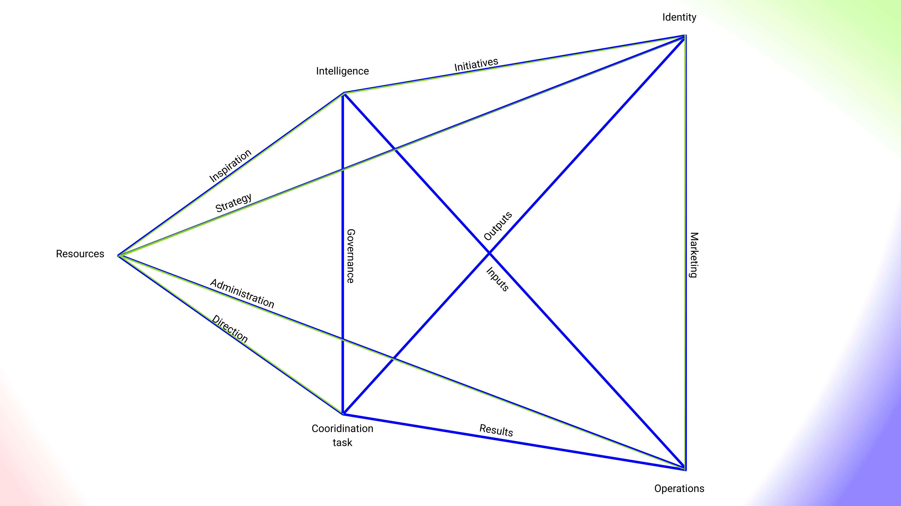

+++
title = "Viable Systems Model"
description = "A reformulation of Stafford Beer's VSM for visual facilitation"
+++

A lot can be said about the VSM, but it would seem that the theoretical overhead often gets in the way of practice, which can really be quite simple.

Below is an interpretation of Stafford's model through the pentadic lens of JG Bennett, which can act as a map for those in leadership wishing to grasp the significance of their organisation, or a game can be facilitated to help self organising groups better align their activities and interests.

The core concept here is to simply map activities to edges, but it helps to be versed in the theory as well.

